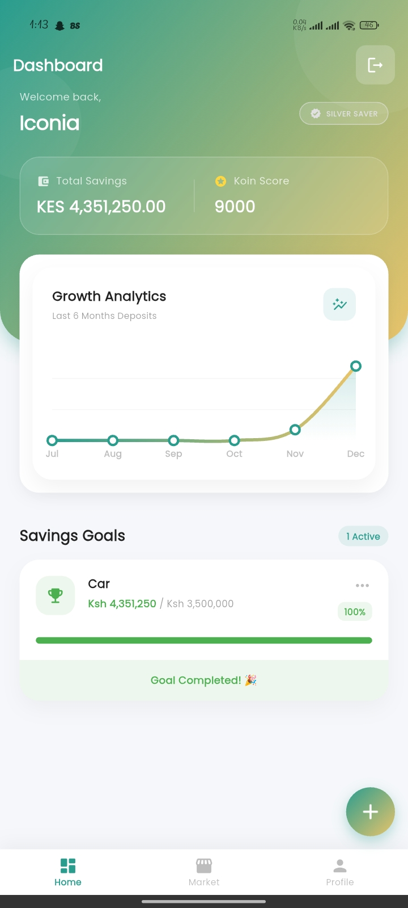
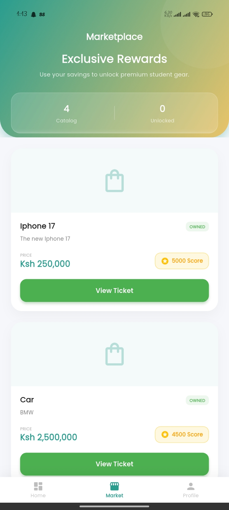
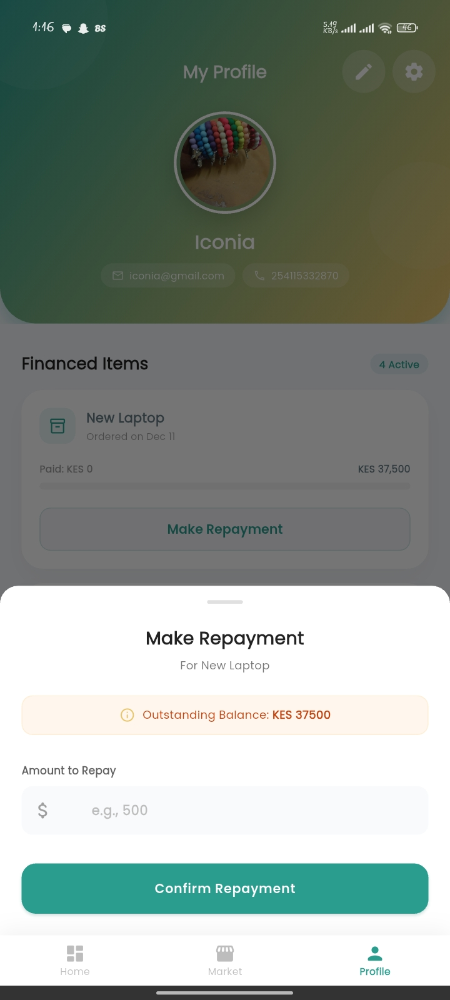
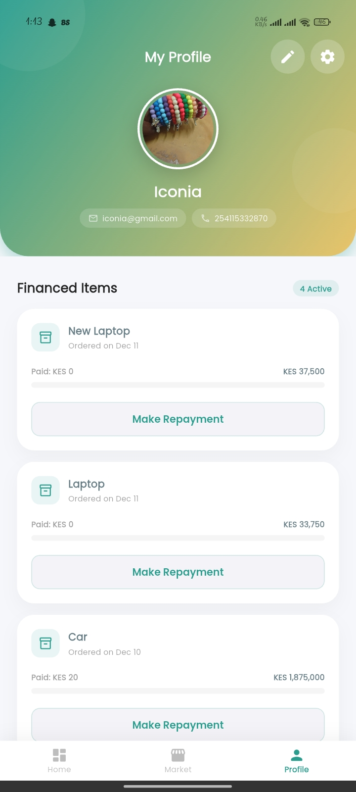

# 🎓 Kampus Koin

Kampus Koin is a gamified financial discipline application designed for students. It empowers users to save money towards specific goals, earn a "Koin Score" for financial discipline, and use that score to unlock access to premium student gear via a "Save Now, Buy Later" financing model.

## 📱 Features

### 💰 Smart Savings & Goals

- **Create Custom Goals**: Students can set up specific savings targets (e.g., "New Laptop", "Tuition").
- **M-Pesa Integration**: Seamless deposits directly to goals using STK Push (via PayHero).
- **Progress Tracking**: Visual progress bars and motivation to keep saving.

### 🎮 Gamification (Koin Score)

- **Earn Score**: Every deposit earns "Koin Score" points.
- **Unlock Products**: High-value items in the marketplace are locked behind a specific Koin Score requirement, enforcing financial discipline before purchasing.

### 🛍️ Marketplace & Financing

- **Exclusive Catalog**: Browse student-essential products.
- **Smart Down Payment**: Unlock items by paying a 25% down payment directly from your accumulated savings.
- **Multi-Source Deduction**: Users can select which specific savings goals to deduct the down payment from.
- **6-Month Repayment Plan**: Remaining balance is split into manageable 6-month installments.

### 🔔 Notifications & Reminders

- **Real-time Alerts**: Instant notifications for successful deposits and order unlocks.
- **Smart Scheduling**: Automated reminders scheduled for:
  - 📅 **7 Days Before Due Date**: Gentle installment reminder.
  - ⚠️ **On Due Date**: Urgent deadline alert (at 10:00 AM).
- **Custom Icons**: Uses app launcher icons for a polished native look.

### 👤 User Profile

- **Identity Management**: Update personal details.
- **Profile Picture**: Upload and persist profile images (hosted on Cloudinary).
- **Transaction History**: Detailed log of all deposits and loan repayments.

## 🛠️ Tech Stack

### Mobile App (Frontend)

- **Framework**: Flutter
- **State Management**: Riverpod
- **Navigation**: GoRouter
- **Notifications**: Awesome Notifications & Firebase Messaging (FCM)
- **HTTP Client**: Dio (with Interceptors for JWT handling)
- **Storage**: Flutter Secure Storage

### Backend API

- **Framework**: Django REST Framework
- **Database**: PostgreSQL
- **Authentication**: JWT (Simple JWT)
- **Payments**: PayHero (M-Pesa Wrapper)
- **Media Storage**: Cloudinary
- **Hosting**: Render

## 🚀 Getting Started

### Prerequisites

- Flutter SDK (3.x.x)
- Python (3.9+)
- PostgreSQL
- Firebase Project (for FCM)
- Cloudinary Account

### 1. Backend Setup
```bash
# Clone the repository
git clone https://github.com/Iconia7/kampus-koin.git
cd kampus-koin/backend

# Create virtual environment
python -m venv venv
source venv/bin/activate  # or venv\Scripts\activate on Windows

# Install dependencies
pip install -r requirements.txt

# Set up environment variables (.env)
# DEBUG=True
# SECRET_KEY=your_secret
# DATABASE_URL=postgres://...
# CLOUDINARY_CLOUD_NAME=...
# FIREBASE_CREDENTIALS=...

# Run migrations
python manage.py migrate

# Start server
python manage.py runserver
```

### 2. Mobile App Setup
```bash
cd kampus-koin

# Install dependencies
flutter pub get

# Generate launcher icons (if needed)
dart run flutter_launcher_icons

# Run the app
flutter run
```

## 📸 Screenshots

| Dashboard | Marketplace | Repayment Plan | Profile |
|-----------|-------------|----------------|---------|
|  |  |  |  |


## 🤝 Contributing

Contributions are welcome! Please fork the repository and create a pull request for any feature updates or bug fixes.

## 📄 License

This project is licensed under the MIT License - see the [LICENSE](LICENSE) file for details.

## 📞 Contact

**Nexora Creatives**

- **Email**: mwanginewton239@gmail.com
- **Phone Number**: +254115332870
- **Developer**: Newton Mwangi

---

*Built with ❤️ by Nexora Creatives Tech Team.*